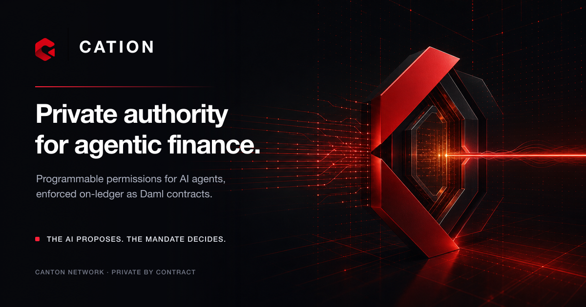
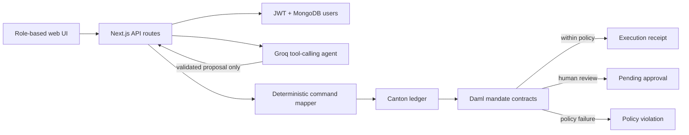

<p align="center">
  
</p>

<h1 align="center">Cation</h1>

<p align="center">
  <strong>Private, programmable financial permissions for AI agents on Canton Network.</strong>
  <br />
  <em>The AI proposes. The mandate decides.</em>
</p>

<p align="center">
  <a href="#overview">Overview</a> ·
  <a href="#architecture">Architecture</a> ·
  <a href="#getting-started">Getting started</a> ·
  <a href="#project-structure">Project structure</a>
</p>



## Overview

Cation is an authorization and risk-control layer for agentic finance. Organizations issue revocable Daml mandates that define what an AI agent may access, who it may transact with, how much it may move, and when a human must approve.

The LLM never holds ledger authority. It can only produce a validated financial proposal; the backend maps that proposal to one fixed Daml choice, and Canton evaluates the mandate deterministically.

### What it provides

- **On-ledger policy enforcement** — category, counterparty, per-action, daily, monthly, expiry, pause, and revocation rules.
- **Three deterministic outcomes** — auto-execute, hold for approval, or deny with a machine-readable violation.
- **Approval without bypass** — approval re-evaluates the latest mandate and spend state before funds move.
- **Private role views** — CFO, agent, compliance, and recipient see different contracts through Canton stakeholder visibility.
- **Concurrency-safe accounting** — consuming Daml choices serialize spend updates; the backend retries once on contention.
- **Serverless application** — one Next.js app hosts the UI and API routes, with outbound access to Canton, MongoDB Atlas, and Groq.

> [!IMPORTANT]
> Cation never gives the LLM contract IDs, party IDs, ledger credentials, generic command submission, or raw signing authority. Request IDs are regenerated server-side before submission.

## Architecture



The agent has one financial tool: `propose_financial_action`. After Zod validation, the API resolves approved counterparty labels to server-side party IDs, generates a fresh request ID, and submits `RequestAction`. That consuming Daml choice always commits one visible outcome:

| Outcome | Result |
| --- | --- |
| Execute | Spend counters update, the demo asset moves, and an `ExecutionReceipt` is created. |
| Approval | A `PendingApproval` is created; no funds move and no spend is counted yet. |
| Denial | A `PolicyViolation` is created with a machine-readable code. |

Policy denial is intentionally a successful ledger transaction, so denied requests remain auditable.

### Contract model

| Template | Purpose |
| --- | --- |
| `MandateOffer` | Principal proposes terms; the agent accepts or rejects. |
| `MandateTerms` | Immutable categories, counterparties, limits, currency, and expiry. |
| `AgentMandateState` | Mutable status, usage, reset boundaries, version, and request deduplication. |
| `PendingApproval` | Human approval or rejection queue. |
| `PolicyViolation` | Minimal compliance-facing denial record. |
| `ExecutionReceipt` | Minimal post-execution record visible to the recipient. |
| `DemoDeposit` | Demo treasury asset used to prove atomic policy evaluation and transfer. |

### Privacy by contract

Cation separates data by audience instead of placing all workflow data in one contract.

| Role | Ledger-visible data |
| --- | --- |
| CFO | Mandates, state, approvals, violations, receipts, and treasury deposits. |
| Agent | Its mandate, allowance, pending requests, violations, and receipts. |
| Compliance | Policy violations only—no prompts, balances, or receipts. |
| Recipient | Its receipts and incoming deposits only—no limits or mandate state. |

Role switching uses separate JWTs mapped to separate Canton parties. The browser never receives a ledger token, and privacy does not depend on client-side filtering.

## Tech stack

- [Daml SDK 3.5.2](https://docs.digitalasset.com/) on Canton Network
- [Next.js 15](https://nextjs.org/) App Router, React 19, and TypeScript
- [Groq](https://groq.com/) with `meta-llama/llama-4-scout-17b-16e-instruct`
- [MongoDB Atlas](https://www.mongodb.com/atlas) for demo users only
- [Zod](https://zod.dev/) for tool and request validation
- [`jose`](https://github.com/panva/jose) and bcrypt for application authentication

The ledger remains the sole source of truth for mandate and business state.

## Getting started

### Prerequisites

- Node.js 20 or later and npm
- Daml SDK 3.5.2 installed through `dpm`
- A Canton validator with the Cation DAR deployed
- Allocated parties for the CFO, agent, compliance officer, and approved recipients
- MongoDB Atlas and Groq credentials
- Either direct Canton JSON API credentials or access to the configured Seaport proxy

### 1. Install dependencies

```bash
npm install
```

### 2. Build and test the contracts

```bash
export PATH="$HOME/.dpm/bin:$PATH"
cd daml
dpm build
dpm test
cd ..
```

The Daml suite covers execution, approval and re-evaluation, limits, expiry, pause/revoke, deduplication, concurrency, authorization, and stakeholder privacy.

### 3. Configure the environment

```bash
cp .env.example .env
cp .env.example apps/web/.env.local
```

Fill both files with the same environment-specific values:

| Group | Variables |
| --- | --- |
| Ledger | `LEDGER_API_URL`, `LEDGER_AUTH_MODE`, `PACKAGE_ID` |
| Seaport proxy | `SEAPORT_API_BASE`, `SEAPORT_ORG_SLUG`, `SEAPORT_VALIDATOR_ID`, `SEAPORT_SESSION_COOKIE` |
| Direct auth | `LEDGER_STATIC_TOKEN` or `LEDGER_OIDC_ISSUER`, `LEDGER_OIDC_CLIENT_ID`, `LEDGER_OIDC_CLIENT_SECRET` |
| Parties | `PARTY_CFO`, `PARTY_AGENT`, `PARTY_COMPLIANCE`, `PARTY_OPS`, `PARTY_RESERVE` |
| Application | `MONGODB_URI`, `JWT_SECRET`, `GROQ_API_KEY` |

Use `LEDGER_AUTH_MODE=seaport-proxy` for the verified DevNet transport. Use `token` or `oidc` when your validator supports direct JSON API command submission.

> [!CAUTION]
> `SEAPORT_SESSION_COOKIE`, ledger tokens, private keys, database credentials, and `JWT_SECRET` are backend-only secrets. Never commit, log, or expose them through `NEXT_PUBLIC_*` variables.

Deploy `daml/.daml/dist/cation-1.0.0.dar` with your validator tooling, then set `PACKAGE_ID` to the deployed package ID.

### 4. Seed the demo

```bash
npm run seed
```

The idempotent seed creates four MongoDB users and, when absent, a `10,000.00 USD` treasury `DemoDeposit` delegated to the agent.

### 5. Run the app

```bash
npm run dev
```

Open [http://localhost:3000](http://localhost:3000). The demo role accounts are `cfo`, `agent`, `compliance`, and `recipient`; each uses the password `cation-demo`.

> [!WARNING]
> The bundled accounts and password are for demonstration only. Replace the demo login and role-switching flow before production use.

## Demo flow

1. Sign in as **CFO** and create a mandate with limits, categories, counterparties, and an expiry.
2. Switch to **Agent** and request a payment below the auto-approval threshold.
3. Request a larger payment, then switch to **CFO** to approve or reject it.
4. Pause or revoke the mandate and retry a valid request to observe an on-ledger denial.
5. Switch to **Compliance** and **Recipient** to compare their party-scoped activity views.

## Commands

| Command | Purpose |
| --- | --- |
| `npm run dev` | Start the Next.js development server. |
| `npm run build` | Create a production web build. |
| `npm run seed` | Seed demo users and the treasury deposit. |
| `npm run typecheck --workspace=apps/web` | Type-check the web app. |
| `npm run typecheck --workspace=packages/agent` | Type-check the agent package. |
| `cd daml && dpm build` | Build the DAR. |
| `cd daml && dpm test` | Run the Daml Script suite. |

## Project structure

```text
.
├── apps/web/               Next.js UI and API routes
│   ├── app/(app)/          CFO, agent, compliance, and recipient views
│   ├── app/api/            Auth, mandate, action, approval, and activity APIs
│   └── lib/                Ledger transports, auth, mandate, and party helpers
├── daml/src/Cation/        Daml templates, types, demo asset, and tests
├── packages/agent/         Groq prompt, tool schema, and runtime
├── scripts/seed-users.ts   Idempotent demo seeding
├── API.md                  HTTP API contract
└── plan.md                 As-built architecture and verification record
```

For route payloads and error shapes, see [`API.md`](./API.md). For security invariants, transport details, and end-to-end evidence, see [`plan.md`](./plan.md).

## Verification status

- Daml contract build succeeds with SDK 3.5.2.
- All 17 Daml Script tests pass.
- Create, exercise, and ACS query flows were verified against real Canton DevNet transactions.
- Auto-execution, approval, current-state re-evaluation, denial records, revocation, and role privacy were verified end to end through the application API.
